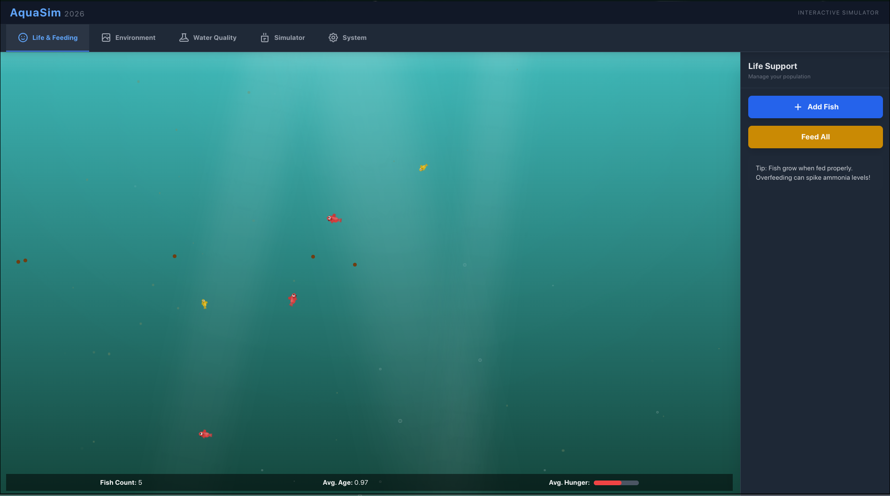

<div align="center">
  <h1>🌌 AquaSim | Simulador de Aquário Interativo</h1>
  <p><i>Simulação front-end de aquário com foco em comportamento de peixes, equilíbrio químico da água e gestão de ecossistema em tempo real.</i></p>

  <p>
    
    
    
    
  </p>
</div>

## Preview



## Visão Geral

O **AquaSim** é uma aplicação construída com **React + TypeScript + Vite** para simular a operação de um aquário com múltiplas variáveis interdependentes. O projeto prioriza separação de responsabilidades, atualização contínua do estado da simulação e organização orientada a domínio para facilitar evolução de features.

A base técnica foi estruturada para manter previsibilidade de comportamento, legibilidade de código e manutenção segura em ciclos de expansão funcional.

## Principais Recursos

### Simulação biológica e comportamental
- Adição de peixes por espécie (água doce e salgada)
- Simulação de fome, saúde, felicidade, crescimento e reprodução
- Alimentação manual por clique e por ação em lote

### Qualidade da água e parâmetros técnicos
- Monitoramento de pH, amônia, nitrito, nitrato, oxigênio, CO2 e temperatura
- Monitoramento avançado de GH, KH, salinidade, fosfato, nível de água e TDS
- Sensores com ruído/calibração e tendências históricas de parâmetros

### Ecossistema e operação do tanque
- Controle de iluminação e evolução de algas
- Decoração com plantas/rochas e efeito no ecossistema
- Ajuste técnico de filtração, aeração, CO2, luz e aquecedor
- Modelo de evaporação com ação de reposição (`top-off`)

### Estado e continuidade
- Salvamento e carregamento do estado do aquário
- Persistência local versionada (`aquariumState`) com compatibilidade para formato legado

## Arquitetura do Sistema

A arquitetura segue uma abordagem modular para isolar responsabilidades de UI, domínio e infraestrutura local.

- `features`: organização por domínio (`aquarium`, `fish`, `ecosystem`, `controls`), concentrando regras e componentes da feature
- `hooks`: loop principal de simulação (`useGameLoop`) com atualização contínua e controle de estado temporal
- `services`: camada de persistência local (`localStorage`) desacoplada da renderização
- `types` e `constants`: contratos e catálogos compartilhados para reduzir acoplamento e regressões

Decisões de arquitetura aplicadas:
- Centralização da lógica de simulação no hook principal
- Separação entre lógica de negócio e componentes visuais
- Contratos tipados para previsibilidade de evolução
- Envelope de persistência com versão para suportar migrações sem quebrar saves antigos

## Documentação Técnica

A documentação detalhada do projeto está organizada em [`/docs`](./docs):

- [`docs/README.md`](./docs/README.md): índice e guia de navegação
- [`docs/arquitetura.md`](./docs/arquitetura.md): responsabilidades por camada e fluxo de dados
- [`docs/simulacao.md`](./docs/simulacao.md): regras do loop, água, comportamento e interações
- [`docs/persistencia.md`](./docs/persistencia.md): schema versionado, compatibilidade e evolução

## Performance

Pontos técnicos já aplicados no projeto:
- Loop de simulação otimizado com `refs`, reduzindo recriações desnecessárias
- Redução de risco de estado obsoleto em atualizações contínuas
- Centralização de animações em `src/index.css` (remoção de CSS injetado por componente)
- Build estático via Vite para entrega enxuta em `dist/`

## Desafios Técnicos

- Manter consistência da simulação com múltiplas variáveis concorrentes em tempo real
- Equilibrar realismo do domínio com legibilidade e manutenibilidade do código
- Preservar desacoplamento entre camada visual e regras de atualização de estado
- Garantir persistência resiliente mesmo com dados locais corrompidos

## Cenários de Balanceamento

Parâmetros base aplicados por ambiente para manter coerência do comportamento das espécies:

| Ambiente | Faixa de pH | Temperatura (°C) | Amônia máx. | Nitrito máx. | Nitrato máx. |
| --- | --- | --- | --- | --- | --- |
| `freshwater` | `6.5 - 7.8` | `22 - 28` | `0.25` | `0.5` | `50` |
| `saltwater` | `7.8 - 8.4` | `24 - 29` | `0.1` | `0.2` | `30` |

Referência de implementação: `src/constants/fish.ts`.

## Roadmap

Implementado nesta etapa:
- [x] Preview versionado no repositório (`.github/preview.png`)
- [x] Versionamento de persistência com envelope (`version`, `savedAt`, `data`)
- [x] Compatibilidade com formato legado de save (sem versionamento)
- [x] Suíte inicial de testes automatizados para storage (`vitest`)
- [x] Documentação técnica de cenários de balanceamento (`freshwater`/`saltwater`)

Próximos passos:
- [ ] Cobrir regras críticas do `useGameLoop` com testes determinísticos
- [ ] Implementar migrações explícitas para futuras versões de estado (`v3+`)
- [ ] Adicionar pipeline de CI para `test + build`
- [ ] Publicar preview animado (`.github/preview.gif`) para demonstrar fluxo completo

## Stack Tecnológica

### Core
- `react` `19.2.0`
- `react-dom` `19.2.0`
- `typescript` `~5.8.2`
- `vite` `^6.2.0`

### Build e tooling
- `@vitejs/plugin-react`
- `@types/node`
- `vitest`
- Tailwind CSS via CDN em `index.html`

## Estrutura do Projeto

```text
src/
  components/
    icons/
  constants/
  features/
    aquarium/
    controls/
    ecosystem/
    fish/
  hooks/
  services/
  types/
  App.tsx
  index.tsx
  index.css
```

## Como Rodar

### Pré-requisitos
- Node.js 18+
- npm

### Desenvolvimento
```bash
npm install
npm run dev
```

### Build de produção
```bash
npm run build
npm run preview
```

### Verificação de tipos
```bash
npx tsc --noEmit
```

### Testes
```bash
npm run test
```

## Deploy

Projeto pronto para deploy estático após `npm run build`.

Opções compatíveis:
- GitHub Pages
- Netlify
- Vercel
- Qualquer hospedagem de arquivos estáticos

## 📄 Licença

Este projeto está sob a licença MIT.

---

<div align="center">
  <p>Desenvolvido por <a href="https://github.com/NullCipherr">Andrei Costa</a></p>
</div>
